# EmojiScape
This plugin converts common RS words in chat to their corresponding in-game icon.

If you have any questions or suggestions feel free to either make an Issue here, or @ me on the Runelite Discord (`@Hannah (loldudester)#6969`)

## Current icons:

- Skills
- High level Prayers (from Retribution to Augury)
- Misc (see Triggers table)

## Current config options:

- Icon Mode: Choose whether to replace the word with the icon, or to place the icon after the word.
- Skill Icons: Choose between Long Triggers ("Attack", "Defence", etc), Short Triggers ("att", "def", etc), or both.
- Prayer Icons: Enable high level Prayer icons.
- Misc Icons: Choose between Long Triggers, Short Triggers, or both.

## Triggers

Triggers are **not** case sensitive and can be preceded or followed by numbers and punctuation.

For example, "99fm!" would be shown as "99!" in Replace Text mode and "99fm()!" in After Text mode.

### Skills

Skills have both Long and Short triggers:

Icon | Long Trigger | Short Trigger
-----|--------------|--------------
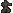 | agility | agi
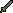 | attack | att
 | combat (or melee) | cmb
 | construction | con
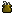 | cooking | cook
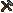 | crafting | craft
 | defence | def
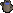 | farming | farm
 | firemaking | fm
 | fishing | fish
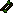 | fletching | fletch
 | herblore | herb
 | hitpoints | hp
 | hunter | hunt
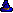 | magic | mage
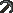 | mining | mine
 | prayer | pray
 | ranged | range
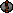 | runecraft | rc
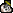 | slayer | slay
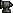 | smithing | smith
 | strength | str
 | thieving | thief
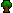 | woodcutting | wc

### Prayers

Prayers only have one trigger each:

Icon | Trigger
-----|--------
 | retribution
 | redemption
 | smite
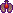 | preserve
 | chivalry
 | piety
 | rigour
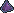 | augury

### Misc

Some misc icons have short triggers, but not all. Those that don't work regardless of if Long or Short triggers are enabled:

Icon | Long Trigger | Short Trigger
-----|--------------|--------------
 | bank | bank
 | altar | altar
 | shortcut | shortcut
 | quest | qp
 | diary | diary
 | minigame | minigame
 | favour | favour
 | arceuus | arc
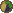 | hosidius | hosi
 | lovakengj | lova
 | piscarilius | pisc
 | shayzien | shayz
 | coins | gp
 | exchange | ge
 | ironman | im
 | hardcore | hcim
 | ultimate | uim
 | jmod | jmod
 | pmod | pmod

### Custom Triggers

You can customise the triggers by editing the contents of the `emojiscape.properties` file in your `.runelite` directory (found at `%userprofile%\.runelite` on Windows and `~/.runelite` on MacOS and Linux).

You can set multiple triggers per icon with a comma separated list. For example, `IRONMAN.ShortTrigger=im, iron` would result in both "im" and "iron" showing the Ironman icon.